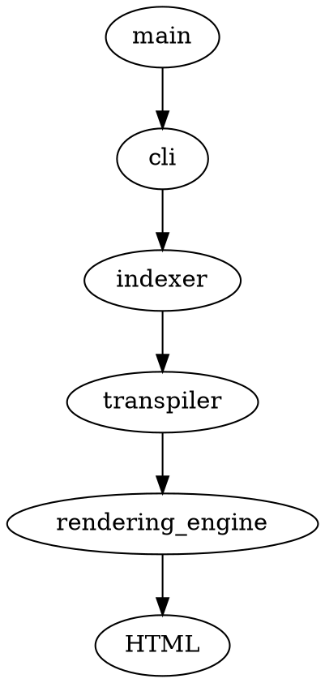

# sych src

## Knowing the codebase

### Knowing about the files

```request
{
  "/recipes": {
    "get": {
      "servers": [{ "url": "https://dummyjson.com" }],
      "description": "Returns all pets from the system that the user has access to",
      "requestBody": {
        "content": {
          "application/x-www-form-urlencoded": {
            "schema": {
              "type": "object",
              "properties": {
                "name": {
                  "description": "Updated name of the pet",
                  "type": "string"
                },
                "status": {
                  "description": "Updated status of the pet",
                  "type": "string"
                }
              },
              "required": ["status"]
            }
          }
        }
      },
      "responses": {
        "200": {         
          "description": "A list of pets.",
          "content": {
            "application/json": {
              "schema": {
                "type": "array",
                "items": {
                  "$ref": "#/components/schemas/pet"
                }
              }
            }
          }
        }
      }
    }
  }
}
```

- `main.rs` - executes the `cli::execute` function to start the sych process.
- `cli.rs` - is the interface which the user interacts with
- `indexer.rs` - indexer converts the markdown into sections where `##` becomes a section inside the doc and others become the child of this section.

> With indexing it is easier for us to browse through the things we write in an orderly manner.

- `transpiler.rs` - is used to convert indexed markdown content into its respective HTML code.

