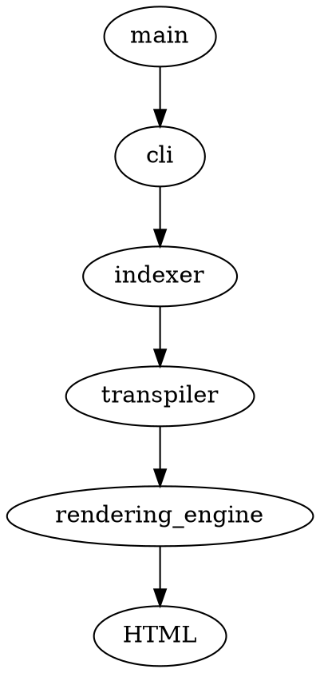

# sych src

## Knowing the codebase

### Knowing about the files

- `main.rs` - executes the `cli::execute` function to start the sych process.
- `cli.rs` - is the interface which the user interacts with
- `indexer.rs` - indexer converts the markdown into sections where `##` becomes a section inside the doc and others become the child of this section.

> With indexing it is easier for us to browse through the things we write in an orderly manner.

- `transpiler.rs` - is used to convert indexed markdown content into its respective HTML code.

